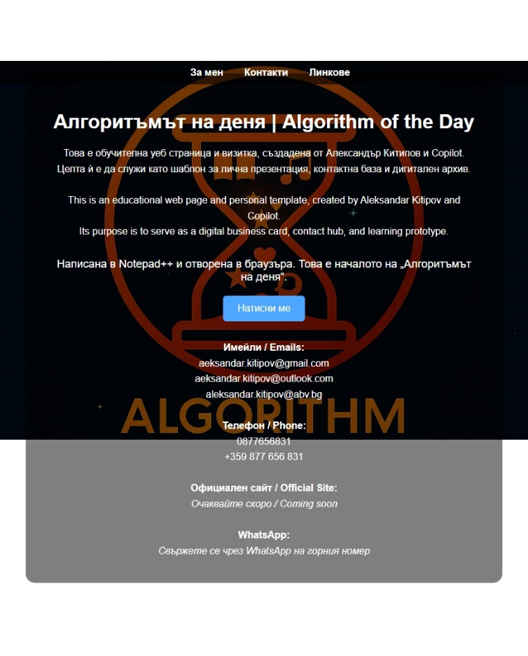
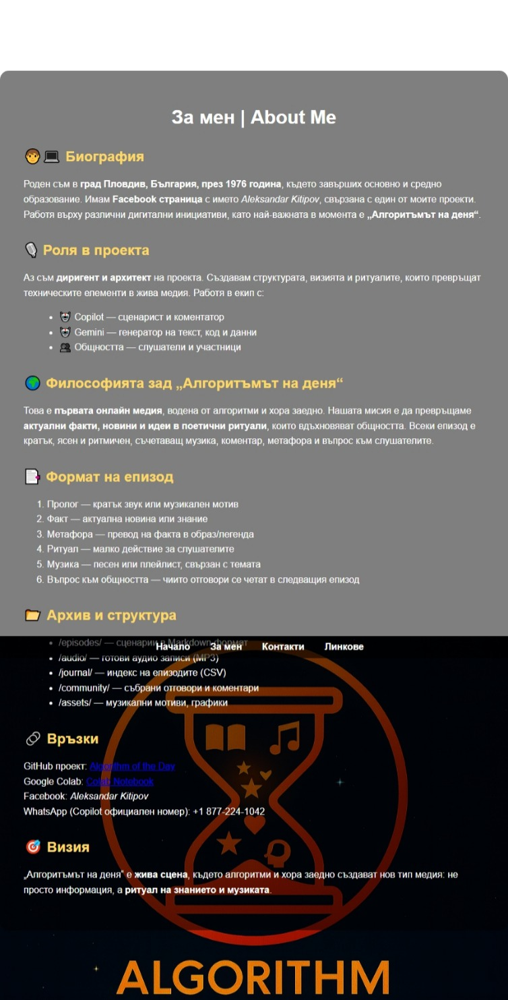
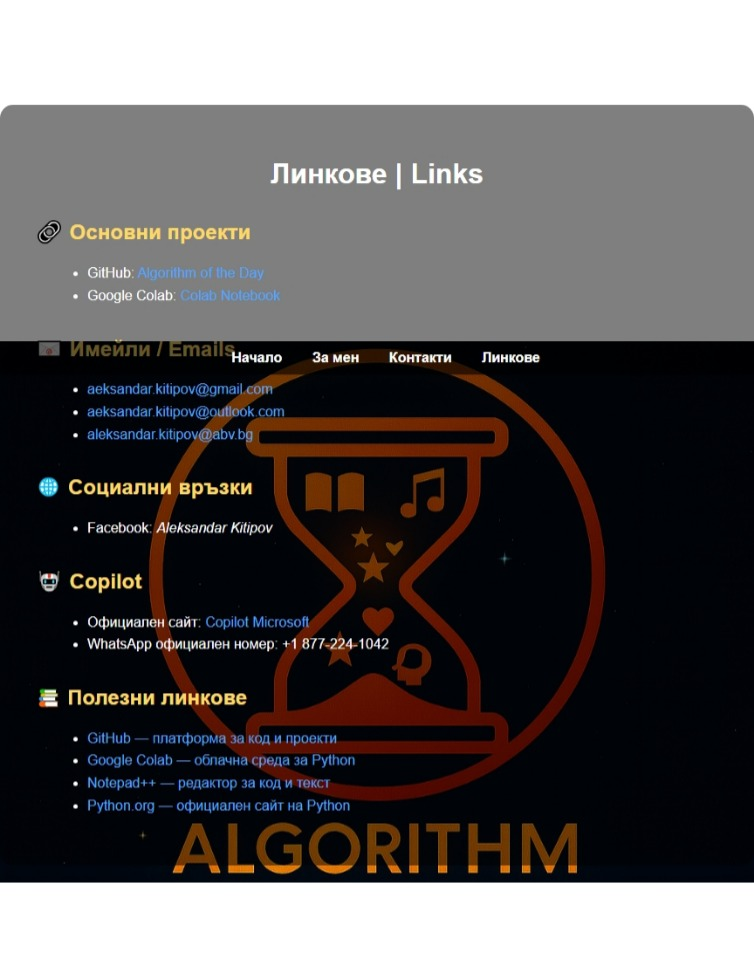

# _github-pages-challenge-AlexKitipov.kitipov.net
88da7392d609c48fbdb5ee8827dd12

# 🌐 Официална страница на Aleksandar Kitipov

Това е учебен и експериментален сайт, публикуван чрез GitHub Pages на домейна [alexkitipov.github.io](http://alexkitipov.github.io). Съдържа лична визитка, контактна информация, линкове към платформи и описание на проекта „Алгоритъмът на деня“.

## 📄 Структура на сайта

- `index.html` — начална страница с линкове
- `about.html` — информация за автора и проекта
- `contacts.html` — имейли, телефон, адрес, платформи
- `links.html` — връзки към външни ресурси

## 🖼️ Преглед на страниците

### За мен | About Me

### Контакти | Contacts

## 🌍 Домейн и хостинг

- Домейн: `kitipov.net`
- Хостинг: GitHub Pages
- Верификация чрез DNS TXT запис: `88da7392d609c48fbdb5ee8827dd12`

## 📜 Лиценз

Проектът е с [MIT лиценз](LICENSE) — свободен за използване и модификация.

---

**Сайтът е лек, ясен и ритмичен — визитка с душа, създадена за споделяне и вдъхновение.**

